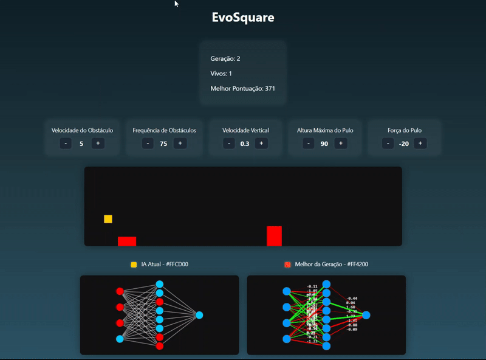

# EvoSquare 🟥🧠

Este projeto é uma simulação de um quadrado controlado por uma **rede neural artificial** que evolui usando **algoritmos genéticos**. Foi inspirado no famoso jogo do dinossauro do Google Chrome e desenvolvido com foco educacional, para o estudo de modelos de inteligência artificial e aprendizado evolucionário.

## 💡 Objetivo

O projeto tem como objetivo estudar como um agente pode aprender a realizar tarefas (como desviar de obstáculos) por meio de seleção natural, mutações e redes neurais simples.

---

## 📸 Demonstração

> Imagem da tela do jogo rodando com as redes neurais:
>
> 

---

## ⚙️ Tecnologias

- HTML5
- CSS3
- JavaScript
- Canvas API
- Algoritmo Genético
- Rede Neural Feedforward

---

## 🧬 Funcionamento

1. **Geração inicial**: 50 quadrados são criados com redes neurais aleatórias.
2. **Entrada da rede neural**:
   - Distância até o obstáculo
   - Largura do obstáculo
   - Velocidade dos obstáculos
   - Altura atual do quadrado

3. **Saída da rede neural**:
   - Probabilidade de pular (se > 0.5, o quadrado pula)

4. **Pontuação**: Cada quadrado ganha pontos por sobreviver.
5. **Seleção e reprodução**: Os melhores indivíduos são usados para gerar a próxima geração.
6. **Mutação**: Pequenas mudanças aleatórias são aplicadas nas redes para permitir evolução.

---

## 🖥️ Controles

Na interface, é possível ajustar os seguintes parâmetros:
- Velocidade dos obstáculos
- Frequência de geração de obstáculos
- Velocidade vertical (gravidade)
- Altura máxima do pulo
- Força do pulo

---

## 🗂️ Estrutura dos Arquivos

- `index.html` – Interface principal do jogo
- `style.css` – Estilização da interface
- `game.js` – Lógica principal do jogo e IA
- `neuralNetwork.js` – Estrutura da rede neural
- `geneticAlgorithm.js` – Lógica de evolução genética
- `visualization.js` – Desenho da rede neural em canvas
- `README.md` – Documentação

---

## 🧠 Futuras Melhorias

- Persistência da melhor rede neural
- Adição de múltiplos tipos de obstáculos
- Parâmetros de mutação ajustáveis na interface
- Exportação e importação dos modelos treinados

---

## 📄 Licença

Projeto com finalidade educacional. Sinta-se livre para estudar, modificar e expandir.